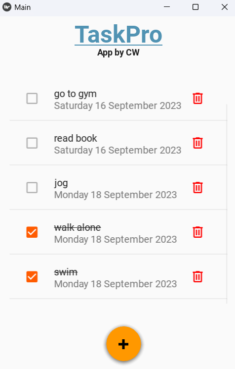

<h1 align="center">

 
TaskPro App 🎯 
</h1>
<h3>◦ Manages All your tasks!</h3>
<h3>◦ Developed with Python , Kivy , Kivymd and Sqlite3</h3>

---

---

## Description

The Task Manager App is a simple Python and Kivy-based application for managing tasks and to-do lists. It allows users to add, complete, and delete tasks with ease. The app also provides a date picker for setting due dates for tasks.

## Features

- Add tasks with due dates.
- Mark tasks as complete or incomplete.
- Delete tasks from the list.
- User-friendly date picker for task due dates.

  
## Installation⚙️

1. Clone the repository: `git clone https://github.com/chinmaywali/TaskPro-App.git`
2. Install the required dependencies by running: `pip install requirements.txt`  (kivy libraries)
3. Run the app using: `python py files and kivy kv files`

## Contributing 🎉

We welcome contributions from the community! Whether you're interested in adding new features, fixing bugs, or enhancing the UI, feel free to submit a pull request. 

## Support 👍

If you encounter any issues, have questions, or want to discuss ideas related to the Galaxy App, you can reach out to us by [creating an issue](https://github.com/yourusername/galaxy-app/issues) on this repository.

  
